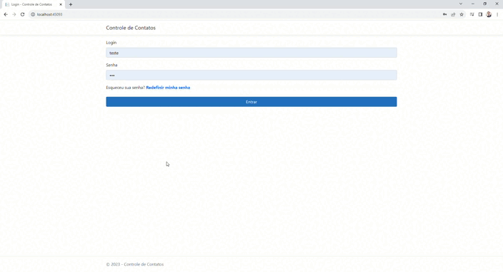
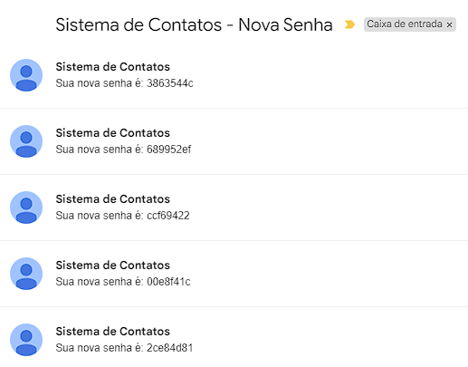

<h1 align="center">Plataforma para Cadastro de Contatos</h1> 

## Tópicos 

- [Descrição](#descricao)

- [Recursos](#recursos)

- [Instalação](#instalacao)

- [Uso](#uso)

- [Contribuição](#contribuicao)

## Descrição

Este projeto é uma aplicação Web desenvolvida em ASP.NET Core, que utiliza o Entity Framework para a persistência de dados, ele foi criado com o objetivo de treinar alguns conhecimentos adquiridos em Entity Framework, como configurar o Entity Framework, estrutura MVC e realizar operações de CRUD (Create, Read, Update, Delete) no banco de dados utilizando migrations, injeção de dependência e consultas com LINQ.

## Recursos

:heavy_check_mark: `1` ASP NET CORE.

:heavy_check_mark: `2` Entity Framework Core.

:heavy_check_mark: `3` Banco de Dados (SQL Server).

:heavy_check_mark: `4` Javascript e Bootstrap.

## Instalação

    
- Clone este repositório para o seu ambiente local: git clone https://github.com/Jonas-Emir/Plataforma_CadastroContatos.git
- Navegue para o diretório do projeto: cd projeto-aspnetcore-entityframework.
- Restaure as dependências do projeto: dotnet restore.
- Configure a string de conexão com o banco de dados no arquivo appsettings.json.
- Execute as migrações para criar o banco de dados: dotnet ef database update.
- Inicie a aplicação: dotnet run.  

## Uso

Após iniciar a aplicação, acesse-a em seu navegador através do seu localhost (http://localhost:5000).  
A partir daí, você poderá interagir com a aplicação, criar um login e senha para o acesso na plataforma e realizar o seu cadastro de contatos! Dentro da aplicação é possível inserir novos contatos que ficarão presentes em uma tabela sendo possível realizar a edição, exclusão e inserção dos contatos cadastrados.

## `Branch: primeiraVersao`

 Uma estrutura inicial criada para fins de treinamento com Entity Framework Core. Essa é a base fundamental a partir da qual o projeto se desenvolveu, serviu como ponto de partida para o crescimento da aplicação.

## `Branch: UpdateProjeto`

Dedicada ao aprimoramento geral da aplicação e adições foram feitas, incluindo a implementação de novas telas e funcionalidades. Entre essas melhorias está a inclusão de um processo de redefinição de senha via email, além de recursos que permitem o acesso ao gerenciamento de contatos por meio de um perfil de administrador.

Demonstrativo dos e-mails recebidos para redefinição de senha.

## Contribuição

Contribuições são bem-vindas! Caso você encontre algum problema, tenha alguma ideia de melhoria ou queira adicionar novas funcionalidades, sinta-se à vontade para criar uma issue ou enviar um pull request.

